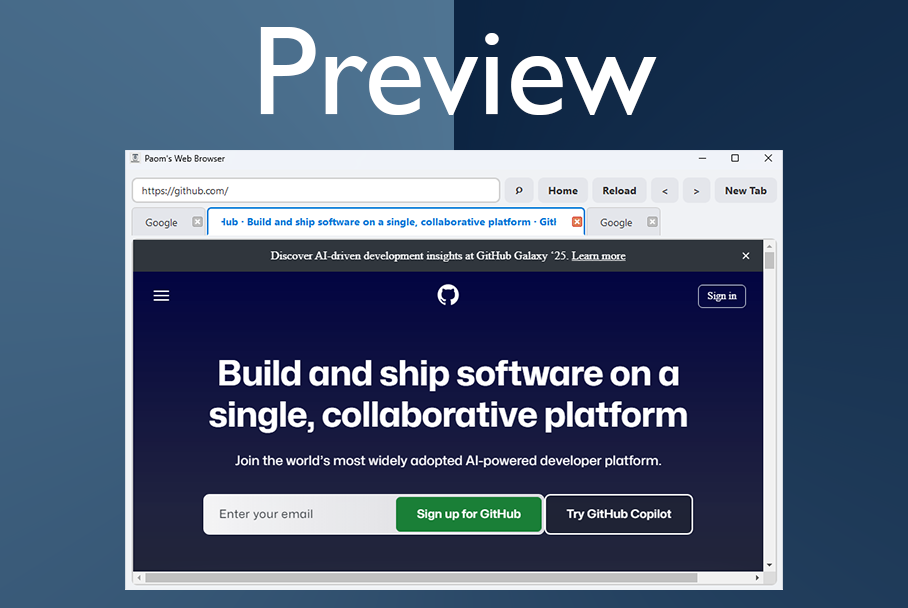

# 🌐 Paom's Web Browser



A clean, minimal, and beginner-friendly web browser built with **Python** and **PyQt5**.

## ✨ Features

- Tabbed browsing
- Custom URL bar with smart search
- Home, Refresh, Back, and Forward buttons
- Google Search fallback for non-URL input
- Stylish modern UI (light theme with blue highlights)
- Easy to extend and customize


## 🛠️ Requirements

- Python 3.x
- PyQt5
- PyQtWebEngine

## 📦 Installation

```bash
pip install PyQt5 PyQtWebEngine
```

## 🚀 Run the browser

```bash
python webbrowser.py
```

## 💡 Customize

You can:
- Change the homepage URL
- Add a bookmarks bar
- Integrate history or download manager
- Switch to a dark theme (or themed tabs!)

## 🧠 About

This project is ideal for beginners who want to:
- Practice PyQt5 GUI development
- Understand signals, slots, layouts, and widgets
- Build something real and useful with Python

---

Happy browsing! 🚀  
Made with ❤️ by Paom
